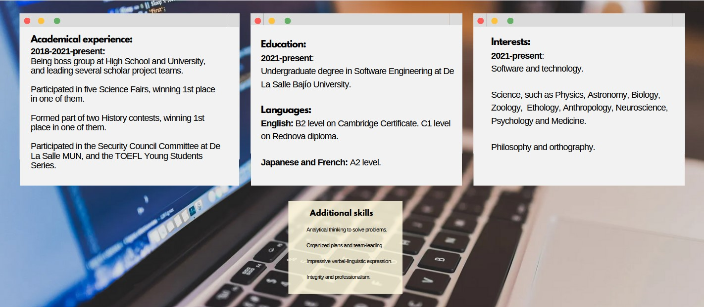

## 🚀 About me
I am a Software Engineering student involved in a holistic approach and knowledge acquisition.

  
## 🧠 Currently learning...

  <h3>Backend:</h3>

  
  
  
  
  

<h3>Front-end and web:</h3>

  
  
   
  
   

<h3>Frameworks:</h3>
 

   
   
  
 

<h3>Tools:</h3>

  
  
  
  
  
  

## 🖊️ Highlights
I took the TECHNOLOchicas PRO course.
 

## ⚡️ Curious fact
I have the objective to specialize in Cybersecurity.

