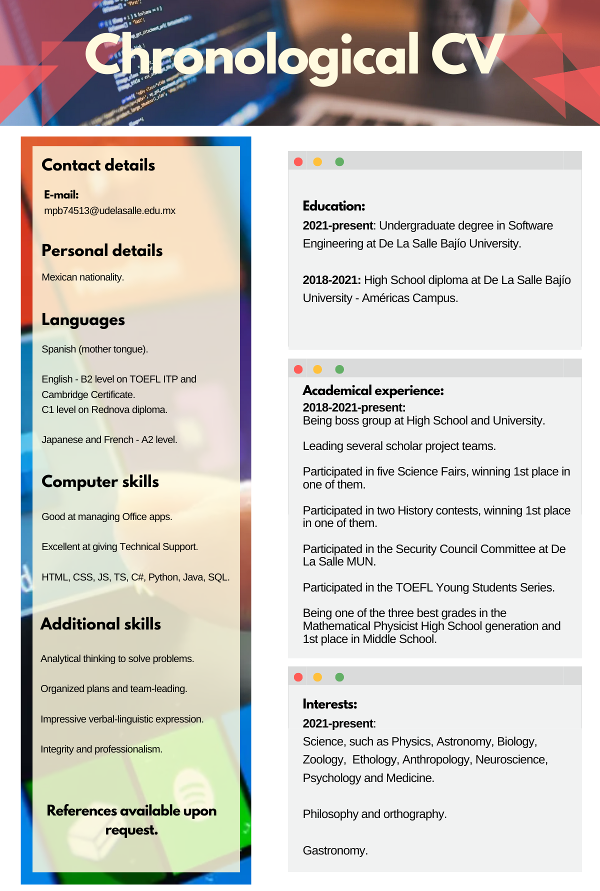

## 🚀 About Me
I'm a Software Engineering student involved in a holistic approach and knowledge acquisition.

  
## 🧠 I'm currently learning...

  
  
   
  
  
  
  
  

## ⚡️ Curious fact...
I'm looking to specialize in Cybersecurity.

